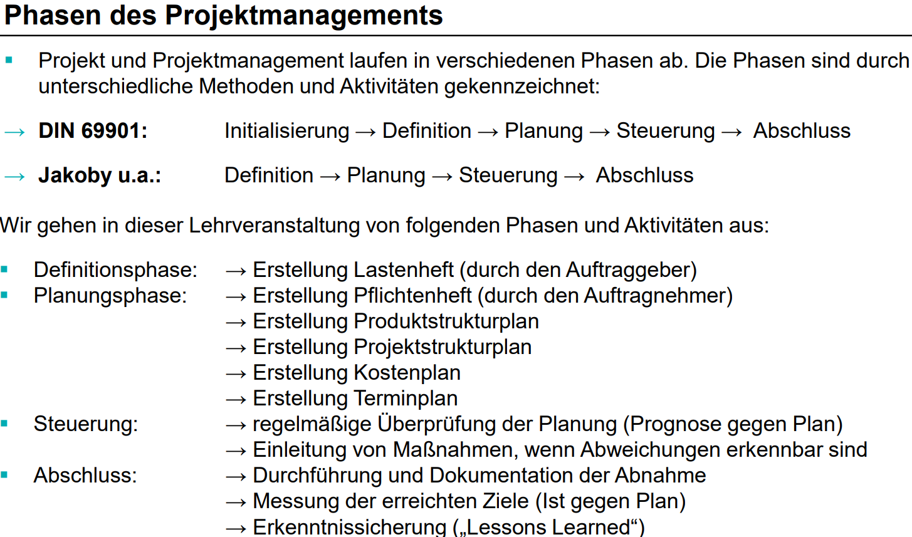

# Fünf Kennzeichen eines Projekts
- Es gibt immer ein klares Ziel.
- Die Erreichung des Ziels ist mit Schwierigkeiten verbunden (Schwierigkeit = Problem)
- An der Erreichung des Zieles sind viele Personen beteiligt.
- Die Ressourcen (z.B. Personal, finanzielle Mittel) sind begrenzt.
- Es gibt einen Anfangs- und Endtermin.

VL1F21

# Abgrenzung Projekt und Aufgabe
Definition von Jakoby für eine Aufgabe:
> Ein System durch geeignete Handlungen aus einem Anfangs- in einen Zielzustand zu bringen, ist eine Aufgabe.

VL1F20

# Arten von Projekten
Differenzierung nach Entscheidungsträger
- interes Projekt
- externes Projekt

...

VL1F18

# Definition von Projektmanagement
.. ist Geschäftsführung auf Zeit.

VL1F23,24

# Phasen des Projektmanagements nach Jakoby

VL1F28

# Vorgehensmodelle 
- Klassisch (Wasserfall)
- Agil (SCRUM, KANBAN)
- Hybrid

VL1F30-35
VL1F38
