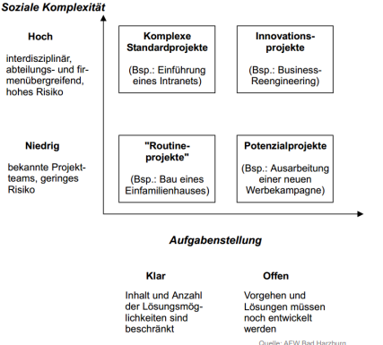

# Fünf Kennzeichen eines Projekts
- Es gibt immer ein klares Ziel.
- Die Erreichung des Ziels ist mit Schwierigkeiten verbunden (Schwierigkeit = Problem)
- An der Erreichung des Zieles sind viele Personen beteiligt.
- Die Ressourcen (z.B. Personal, finanzielle Mittel) sind begrenzt.
- Es gibt einen Anfangs- und Endtermin.

VL1F21

# Abgrenzung Projekt und Aufgabe
Definition von Jakoby für eine Aufgabe:

*Ein System durch geeignete Handlungen aus einem Anfangs- in einen Zielzustand zu bringen, ist eine Aufgabe.*

> Routinierte Zustandsänderung (Schwierigkeits-/Problemcharakter fehlt) = Aufgabe

... für ein Projekt
> siehe oben

VL1F20

# Arten von Projekten
**Differenzierung nach Entscheidungsträger**
- interes Projekt
- externes Projekt

**Differenzierung nach Projektart**
- Organisationsprojekte
- Investitionsprojekte
- Forschungs- und Entwicklungsprojekte

**Differenzierung nach Risiko und Aufgabenstellung**
- Routineprojekte
- Innovationsprojekte
- komplexes Standardprojrekt
- Potenzialprojekt

VL1F18f.

# Definition von Projektmanagement
.. ist Geschäftsführung auf Zeit.

- Das Projektmanagement / der Projektmanager übernehmen im Projekt temporär die gleiche Verantwortung, die einem Geschäftsführer bei der Führung des Unternehmens zukommt.
- Projektmanagement / Projektmanager haben also das Projekt „als Ganzes“ im Fokus und leisten auf diese Weise einen Beitrag zur Sicherung des Unternehmenserfolges.

VL1F23,24

# Phasen des Projektmanagements nach Jakoby

VL1F28

# Vorgehensmodelle 
- Klassisch (Wasserfall)
- Agil (SCRUM, KANBAN)
- Hybrid

VL1F30-35
VL1F38
