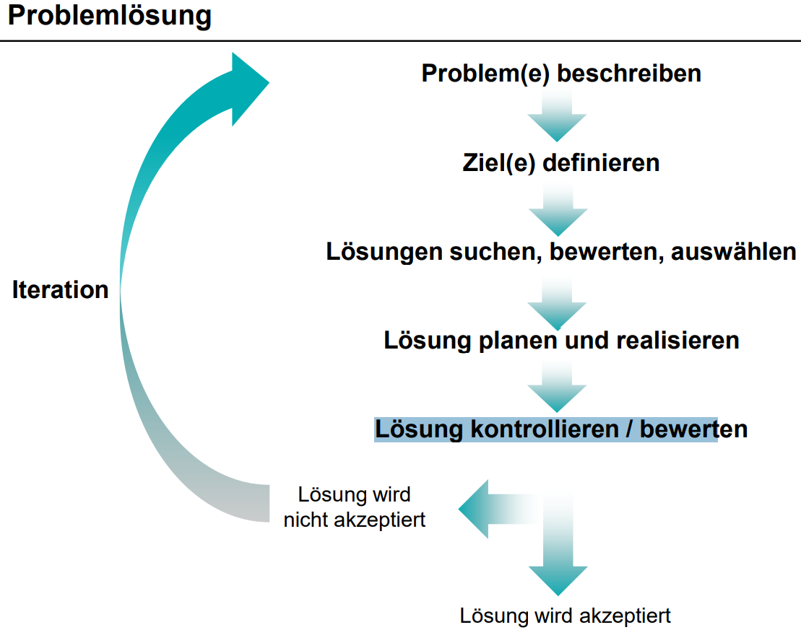
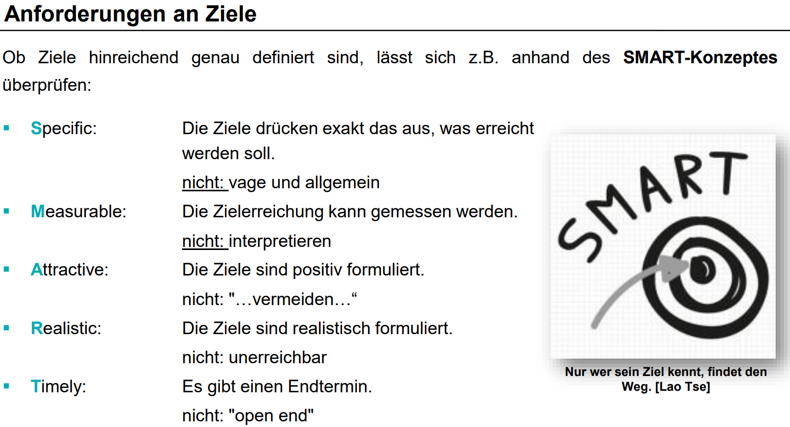
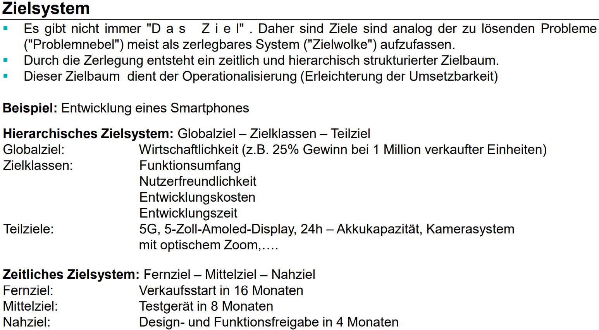
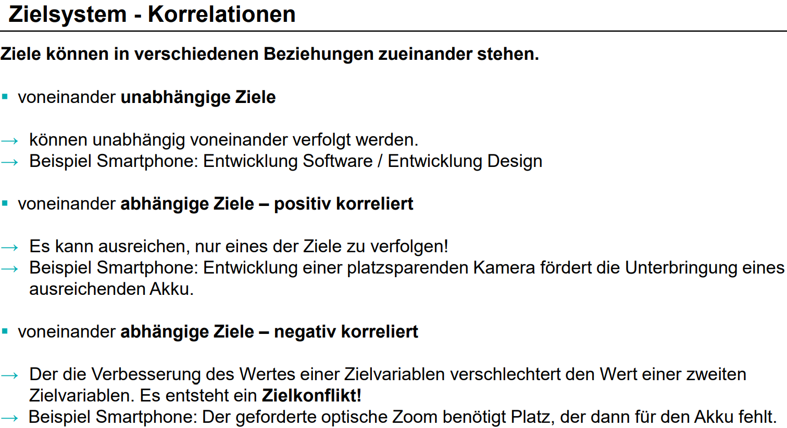

# Problemlösung ist ein iterativer Prozess

VL2F8

# Zielgestaltung - SMART 

- Spezifisch
- Messbar
- Attraktiv
- Realistisch
- Terminiert

VL2F14

# Hierachisches und Zeitliches Zielsystem

VL2F17

# Beziehung von Zielen

VL2F18

# Zielsysteme - Gütekriterium und Randbedingung
Berechnung relevant

VL2F19-21

# Zieldreieck von Projekten

VL2F38-44
VL2F41
