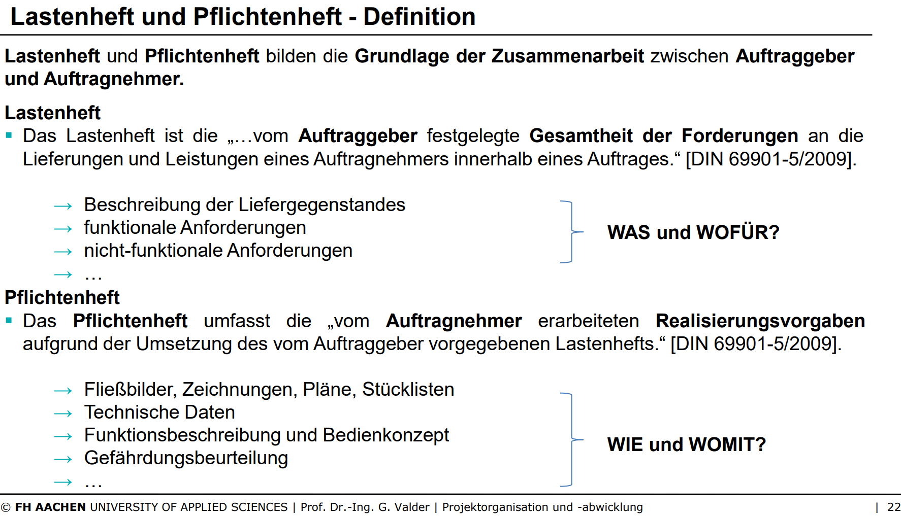

# Definition Lasten- und Pflichtenheft

VL3F22

# Reihenfolge und Zuständigkeit
| Plan | Zuständigkeit |
|:------:|:-----------:|
| Lastenheft | Auftraggeber |
| Pflichtenheft | Auftragnehmer |
| Produktstrukturplan | Auftragnehmer |
| Projektstrukturplan | Auftragnehmer |
| Vorgangsliste | Auftragnehmer |
| Ressourcenplanung | Auftragnehmer |
| Zeitplanung & Kostenplanung | Auftragnehmer |

VL3F31

# Zusammenfassung Last und Pflichtenheft
Aus Vorlesungs Video

VL3F33
