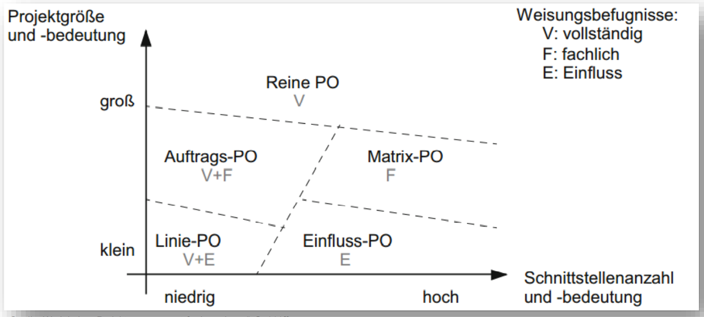
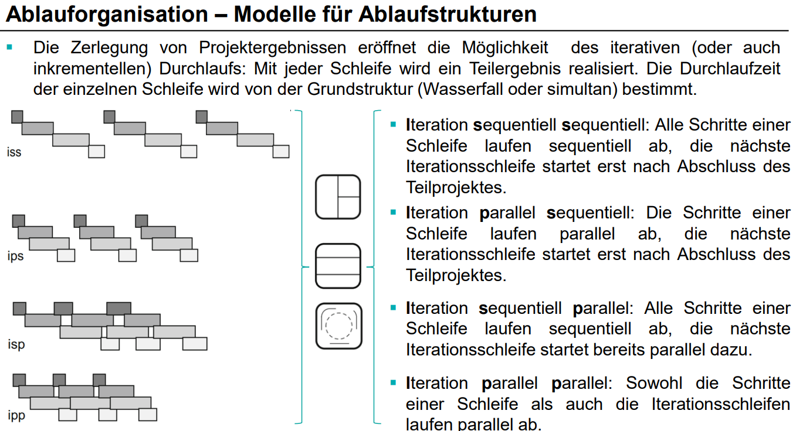

# Aufbauorganisation 
- **Reine Projektorganisation**
  - Projektmitarbeiter werden aus verschiedenen Bereichen (Vertieb, Entwicklung, Fertigung, ...) für das eine Projekt zusammengezogen.
  - Sind fachlich und disziplinarisch dem Projektleiter unterstellt. (Nur ein Vorgesetzter)
  - Die reine Projektorganisation ist eher bei Großprojekten mit langer Laufzeit geeignet
- **Matrixorganisation**
  - Projektmitarbeiter gibt fachlich vor, was getan werden muss.
  - Die Umsetzung erfolgt innerhalb der Bereiche/Linien.
  - Die Matrixorganisation eignet sich grundsätzlich für jede Projektform, sofern die sozio-kulturellen Voraussetzungen für funktionierende Zusammenarbeit von „Linie“ und „Projekt“ gegeben sind.
- **Auftrags-Projektorganisation**
  - Mischform der reinen Projektorganisation und der Matrix-Organisation – es gibt sowohl disziplinarisch als auch lediglich fachlich zugeordnete Mitarbeiter.
  - Eignet sich vor allem dann, wenn viele Projekte mittlerer Größe bearbeitet werden.
- **Einfluss-Projektorganisation**
  - Das Projektmanagement wird von einer Stabsstelle, welche z.B. an die Unternehmensleitung angebunden wird, durchgeführt.
  - Eignet sich nur bei internen Projekten. Für externe Projekte nicht zu empfehlen.
- **Projektleitung in der Linie**
  - Das Projektmanagement wird von einem Linienvorgesetzten durchgeführt.
  - Eignet sich vor allem für kleine Projekte. 

VL5F8-17
VL5F20

# Parallelität
Iteration `Ablauf Aufgaben in Teilprojekt` `Ablauf Teilprojekte`

VL5F25?-27
VL5F30

# Übersicht Modelle

VL5F31
VL5F32? (ggf. Video)
