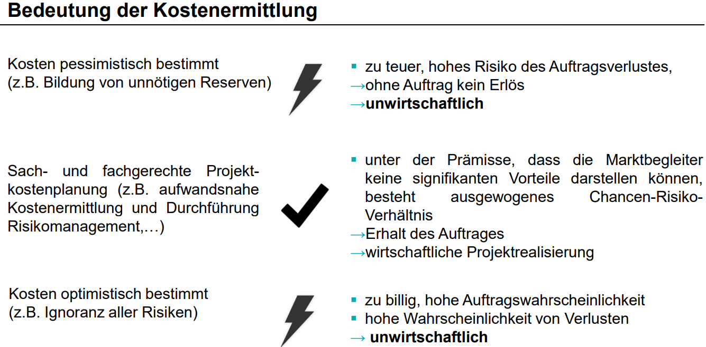

# Berechnung Break even point
- Der Punkt ab dem man Gewinn machen würde.
- Kosten = Erlös
- `Menge = Fixkosten / (Preis - Variable Kosten)`

VL7F8-10

# Schätzung von Kosten

VL7F13

# PERT
- Dient der Schätzung der Dauer von Arbeitspaketen/Zeitaufwands. (Schätzen ist nicht Wissen, aber besser als Raten.)
- Dreipunktschätzung:
  - Pessimistische Schätzung
  - Optimistische Schätzung
  - Realistische Schätzung
- Erwarteter Zeitaufwand: `VL7F24`

- Formel vorgegeben.

VL7F15-27
VL7F18

# Risikobewertung - RPZ
> RPZ = A * E * B

- **A**uftrittswahrscheinlichkeit
- **E**ntdeckungswahrscheinlichkeit
- **B**edeutung

TODO

> RPZ kleiner als 40 => Unkritisch, keine Maßnahmen erforderlich
> RPZ größer als 100 => Vorbeugende Maßnahmen erforderlich

VL7F30-34
VL7F33
