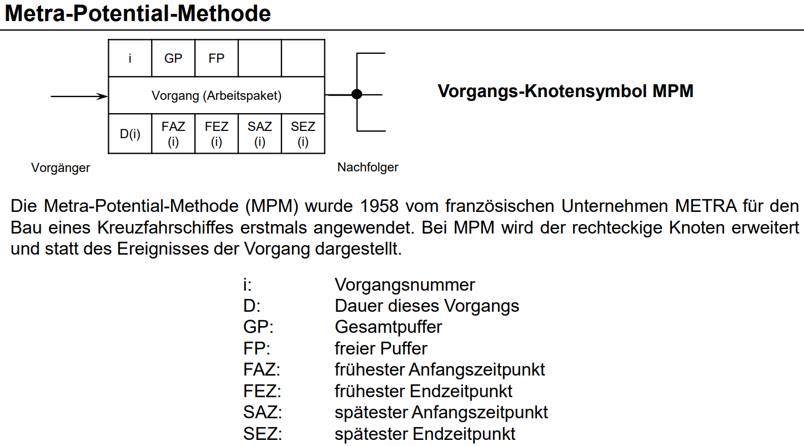

# Netzplan
**Gesamtpuffer**
Dauer, um die der Anfangszeitpunkt (Vorwärtsplanung) oder der Endzeitpunkt (Rückwärtsplanung) eines Vorgangs verschoben werden kann, ohne dass die Projektdauer beeinflusst wird.

**Freier Puffer**
Dauer, um die der frühestmögliche Anfangszeitpunkt eines Vorgangs verschoben werden kann, ohne dass sich der frühestmögliche Anfangszeitpunkt seines Nachfolgers ändert.

**Kritischer Pfad**
Diese Vorgänge dürfen nicht verschoben werden, sonst wird der Endtermin nicht gehalten. Die Puffer (GP & FP) sind auf diesem Pfad 0.

- Vorgänge (Nummer, Bezeichnung, Dauer) in Kästen übertragen
- "Vorwärts durchrechnen"
  - `FAZ (frühste Anfangszeitpunkt) = max(vorherigen Vorgänge FEZ, 0)`
  - `FEZ (frühster Endzeitpunkt) = FAZ + D`
- "Rückwärts durchrechnen" 
  - `SEZ (spätester Endzeitpunkt) = min(nachfolgende Vorgänge SAZ)`, bei letztem Vorgang FEZ 
  - `SAZ (spätester Anfangszeitpunkt) = SEZ - D`
- Puffer bestimmen
  - `GP (Gesamtpuffer) = SAZ - FAZ`
  - `FP (freier Puffer) = min(FAZ nachfolgende Vorgänge) - FEZ`

VL8F19
Eig komplette Vorlesung
