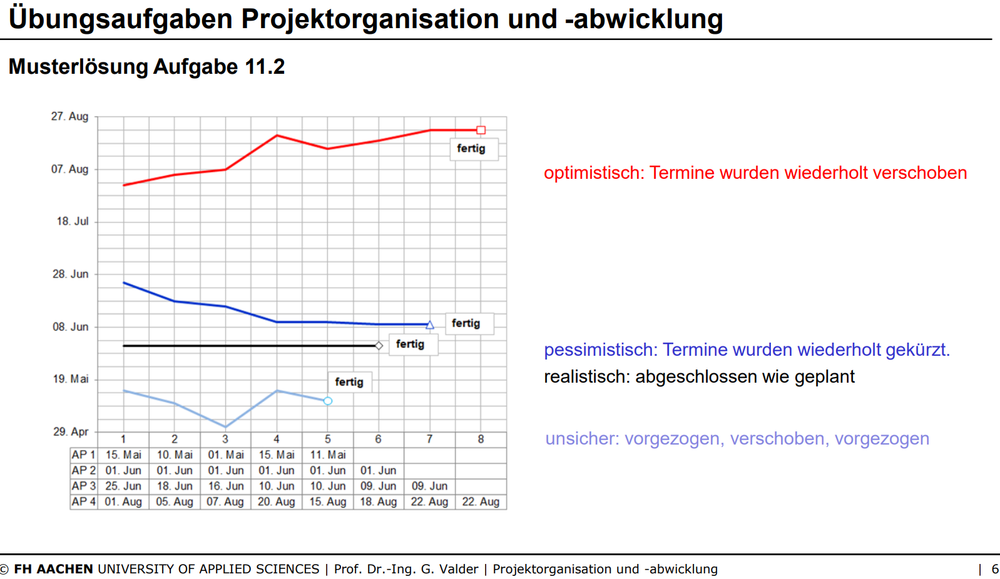

# Klalkulationen/Kostenarten

**Kostenprognose**
- Prognose setzt sich aus
  - **I**stkosten der **Vergangenheit** (bereits in Rechnung gestellt worden)
  - **B**estellkosten der **Gegenwart** (noch durch getätigte Bestellungen verbindlich entstehen werden)
  - **E**rwartete Kosten in **Zukunft** (noch erforderlich sein werden, um das Projekt abzuschließen)

VL11F8-15 ca.

# Earned Value Analyse (EVA)

**Eingabeparameter** (VL11F30)
| Beschreibung | Bezeichnung | Woher? |
|--------------|-------------|--------|
| Die Gesamtkosten des Projekts (intern + extern) | BAC – Budget at Completion | Kostenplanung |
| Die Gesamtdauer des Projekts bis Abnahme | TAC – Time at Completion | Terminplanung |
| Den Fertigstellungsgrad am Stichtag der Analyse | SOC – Stage of Completion | noch offen   `SOC = Istkosten/erwartete Gesamtkosten` |
| Die Ist-Kosten am Stichtag der Analyse | AC – Actual Cost | Kosten- und Terminsteuerung   `AC = Istkosten (ext+int) + Bestellkosten (ext)` |
| Die Plankosten am Stichtag der Analyse | PV – Planned Value | noch offen   Aus Kostenplanung ablesen |

**Earned Value** 
- Das sind die aktuell "geernteten" Umsatzerlöse. (VL11F33)
- `EV = SOC * BAC`

**Termintreue (Schedule Variance und Schedule Performance Index)**
- `SV = EV - PV`
- Deutung
  - `< 0` das Projekt ist langsamer als geplant
  - `= 0` das Projekt ist im Zeitplan
  - `> 0` das Projekt ist schneller als geplant
- VL11F36,42

**Kostentreue (Cost Variance und Cost Performance Index)**
- `CV = EV - AZ`
- Deutung
  - `< 0` das Projekt ist teurer als geplant
  - `= 0` das Projekt ist im Plan
  - `> 0` das Projekt ist günstiger als geplant
- VL11F37,41

Weitere Hinweise:
- Sollte nach Möglichkeit getrennt nach interenen und externen Kosten durchgeführt werden.
- 

VL11F29ff.
VL11F41
VL1135-42?

# Meilensteintrendanalyse

VL11F72
Übung

# Eig alles?

VL11
